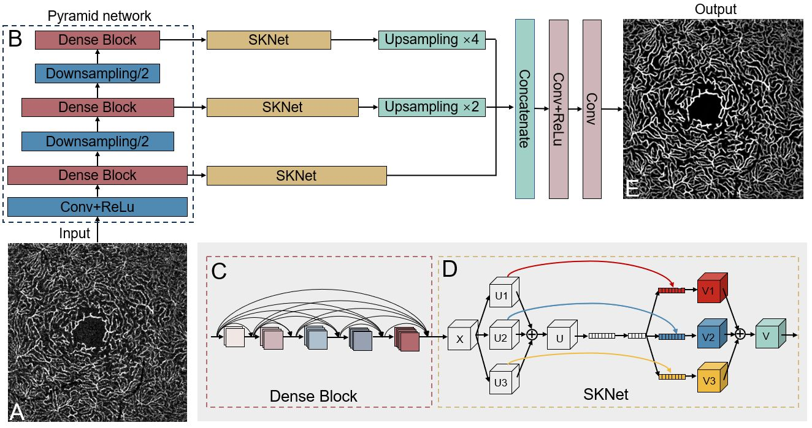
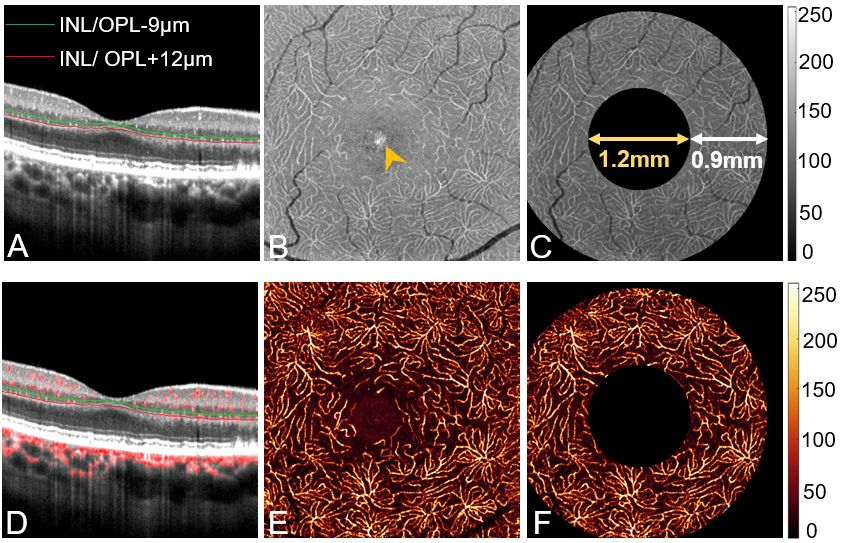
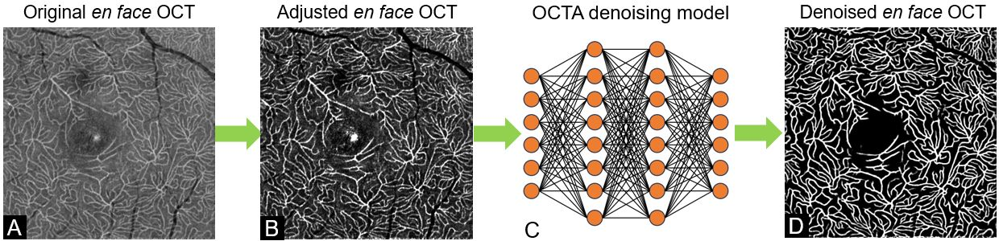

# Nonperfused Retinal Capillaries - A New Method Developed on OCT and OCTA   

By [**Min Gao**](https://scholar.google.com/citations?user=T1vzVnYAAAAJ&hl=en), [**Yukun Guo**](https://scholar.google.com/citations?user=BCrQPWUAAAAJ&hl=en&oi=sra), [**Tristan T.Hormel**](https://scholar.google.com/citations?user=jdD1rGwAAAAJ&hl=en), Jie Wang, Elizabeth White, Dong-Wouk Park, [**Thomas S. Hwang**](https://www.researchgate.net/profile/Thomas-Hwang-2), [**Steven T. Bailey**](https://www.researchgate.net/profile/Steven-Bailey-10), [**Yali Jia**](https://scholar.google.com/citations?user=hfBY5K8AAAAJ&hl=en&oi=sra)

This repo is the official implementation of "[**Nonperfused Retinal Capillaries - A New Method Developed on OCT and OCTA**]

This software is copyrighted and may only be used for academic research.

Please cite this paper if you use any component of the software.

Gao M, Guo Y, Hormel TT, Tsuboi K, Pacheco G, Poole D, Bailey ST, Flaxel CJ, Huang D, Hwang TS, Jia Y. A deep learning network for classifying arteries and veins in montaged wide-field OCT angiograms. Ophthalmology Science. 2022 Apr 1:100149.

## Introduction

Combining co-registered optical coherence tomography (OCT) and OCT angiography (OCTA) signals allows in vivo quantification of occluded capillaries. This study aims to develop a new method to quantify nonperfused retinal capillaries (NPCs) and evaluate NPCs in eyes with age-related macular degeneration (AMD) and diabetic retinopathy (DR). We averaged multiple registered OCT/OCTA scans to create high-definition volumes. The deep capillary plexus slab was defined and segmented. A developed deep learning denoising algorithm removed tissue background noise from capillaries in en face OCT/OCTA. The algorithm segmented NPCs by identifying capillaries from OCT without corresponding flow signals in OCTA. We then investigated the relationships between NPCs and known features in AMD and DR. The segmented NPC achieved an accuracy of 88.2% compared to manual grading of DR. Compared to healthy controls, both the mean number and total length (mm) of NPCs was significantly increased in AMD and DR eyes (P < 0.001, P <0.001). Compared to early and intermediate AMD, the number and total length of NPCs were significantly higher in advanced AMD (number: P<0.001, P<0.001; total length: P = 0.002, P =0.003). Geography atrophy, macular neovascularization, drusen volume, and extrafoveal avascular area (EAA) significantly correlated with increased NPCs (P<0.05). In DR eyes, NPCs correlated with the number of microaneurysms and EAA (P<0.05). The presence of fluid did not significantly correlate with NPCs in AMD and DR. A deep learning-based algorithm can segment and quantify retinal capillaries that lack flow using colocalized OCT/OCTA. This new biomarker may be useful in AMD and DR.

#### Figure 1. OCTA denoising algorithm flowchart.


## Getting Start

### Clone our repo

```bash
git clone git@github.com:octangio/OCTA_denoising.git
cd OCTA_denoising
```

### install packages

  ```bash
  pip install -r requirements.txt
  ```
  The code version we used in the paper is CAVnet-1.0.
### Train model on your own data

- prepare data
  
  The en face angiograms have normalized the range of decorrelation value (SSADA) from (0.02, 0.3) to the range of (0, 255). The data set folder should be like the following structure.

    ```bash
    dataset
    |
    |-- train_image
    |   |
    |   |_list.txt
    |   |- image_0001.png
    |   |- image_0002.png
    |   |- ...
    |
    |-- train_label
    |   |
    |   |_list.txt
    |   |- label_0001.png
    |   |- label_0002.png
    |   |- ...
    |
    |-- valid_image
    |   |
    |   |_list.txt
    |   |- image_0001.png
    |   |- image_0002.png
    |   |- ...
    |
    `-- valid_label
        |
        |   |_list.txt
        |- label_0001.png
        |- label_0002.png
        |- ...
  ```
  Then you need to generate the path list of image and label. 

- Training
  
  ```bash
  python my_train.py --train_image=./dataset/train_image/_list.txt --train_label=./dataset/train_label/_list.txt --batch_size=4 --input_height=320 --input_width=320   
  ```
- Test

  ```bash
  python predict_results.py --test_data_path=./dataset/test_data_path --save_path=./dataset/denoising_output --logdir=./logs/saved_model.hdf5
  ```
 #### Figure 2. Projection of en face OCT/OCTA.



 #### Figure 3. En face OCT/OCTA denoising.




